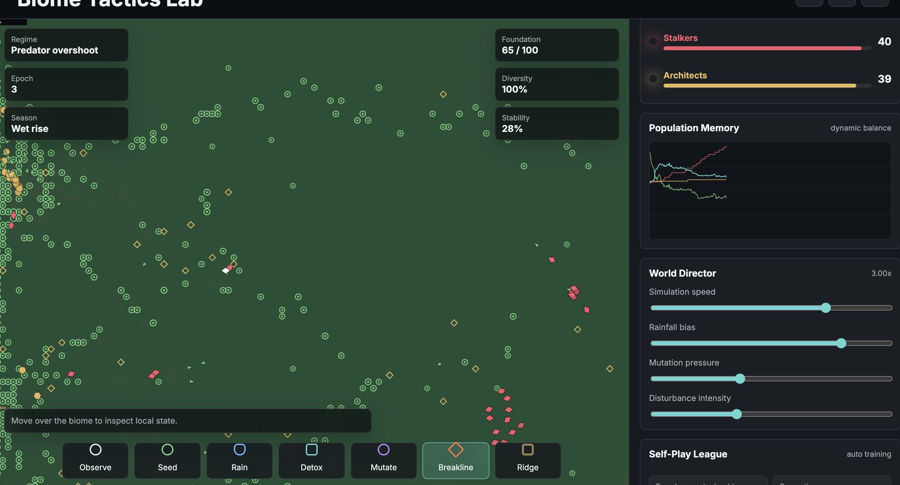

# Biome Tactics Lab

Vectorized self-play ecology sim where predator, prey, and builder policy genomes co-adapt across 10,000 `Float32Array` shadow biomes with dense rewards, opponent pools, novelty pressure, and live champion transfer.



I wanted this to feel like a tiny research lab disguised as a game. The visible world is an agent-based biome: foragers eat/spread flora, stalkers hunt them, and architects mine minerals to build barriers, nurseries, detoxifiers, beacons, and dens. The map is not just background art either: moisture, terrain, nutrients, toxicity, fire, minerals, seasons, and structures all change the strategy.

The self-play part runs separately from the live canvas. Each generation mutates compact policy genomes and evaluates them in batched shadow rollouts. Rewards are split across survival, trophic balance, construction utility, disturbance recovery, ecosystem foundation, and novelty. The best genomes enter the champion pool, and you can inject them back into the live biome to watch the equilibrium shift.

## Stack

- vanilla JS modules, HTML canvas, CSS grid
- typed-array vectorized shadow environments
- agent simulation with spatial hashing
- evolution-strategy mutation and elite selection
- dense multi-objective reward shaping
- opponent/champion archive

## Run

```bash
npm run dev
```

Open `http://127.0.0.1:5173`.
